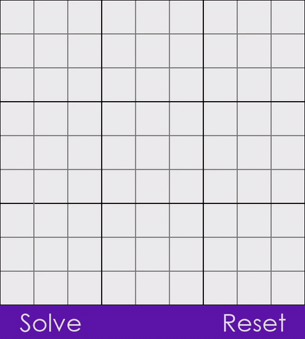

# Sudoku solver - Godot
### How to use
  - Click a tile and then press number to input
  - Once all numbers have been placed on the grid, press enter or the solve button to solve
  - To reset the grid at any time press the reset button or the "r" key
  - To un-select a selected tile press the escape key

### Installation
Created in Godot 3.2, use version to build

### Evidence

